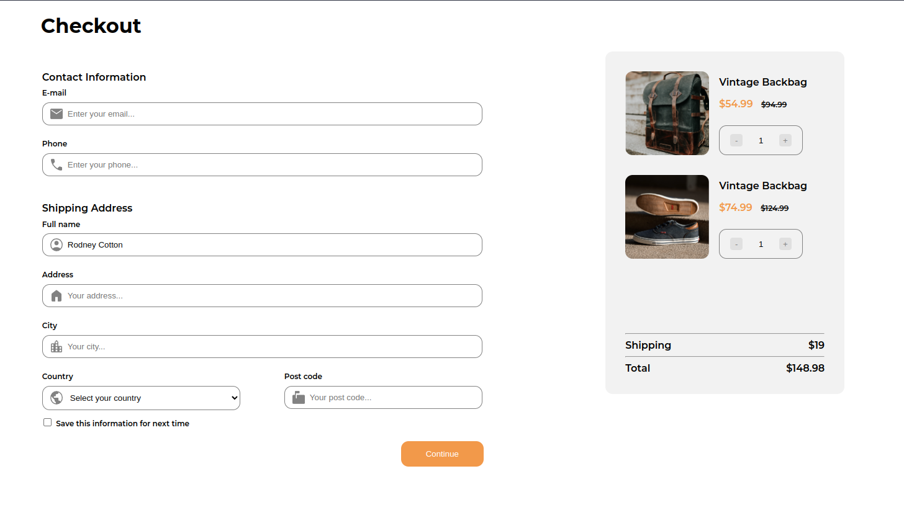

<!-- Please update value in the {}  -->

<h1 align="center">Checkout page</h1>

   Solution for a challenge from  <a href="http://devchallenges.io" target="_blank">Devchallenges.io</a>.

  <h3>
    <a href="https://cheery-moonbeam-5e59de.netlify.app/}">
      Demo
    </a>
     | 
    <a href="https://github.com/dXu23/checkout-page">
      Solution
    </a>
     | 
    <a href="https://devchallenges.io/challenges/0J1NxxGhOUYVqihwegfO">
      Challenge
    </a>
  </h3>

<!-- TABLE OF CONTENTS -->

## Table of Contents

- [Overview](#overview)
  - [Built With](#built-with)
- [Features](#features)
- [Contact](#contact)
- [Acknowledgements](#acknowledgements)

<!-- OVERVIEW -->

## Overview

Introduce your projects by taking a screenshot or a gif. Try to tell visitors a story about your project by answering:

- Where can I see your demo?
Right [here](https://cheery-moonbeam-5e59de.netlify.app/)

- What was your experience?

I didn't really like the project because I wasted too much time
trying to find a way to style the buttons on input[type=number],
when there exists no such method.

- What have you learned/improved?

I learned how to use Google Material Icons.

- Your wisdom? :)

Sometimes, you have to learn to discard the browser's native functionality such
as the up and down buttons on inputs and create your own up and down buttons to
achieve the look and functionality you need.
### Built With

<!-- This section should list any major frameworks that you built your project using. Here are a few examples.-->

- HTML
- CSS
- Javascript

## Features

<!-- List the features of your application or follow the template. Don't share the figma file here :) -->

This application/site was created as a submission to a [DevChallenges](https://devchallenges.io/challenges) challenge. The [challenge](https://devchallenges.io/challenges/0J1NxxGhOUYVqihwegfO) was to build an application to complete the given user stories.

Just open index.html in the browser.

## Contact

- [Website](https://https://rad-sunshine-871fb5.netlify.app/)
- [GitHub](https://github.com/dXu23})
